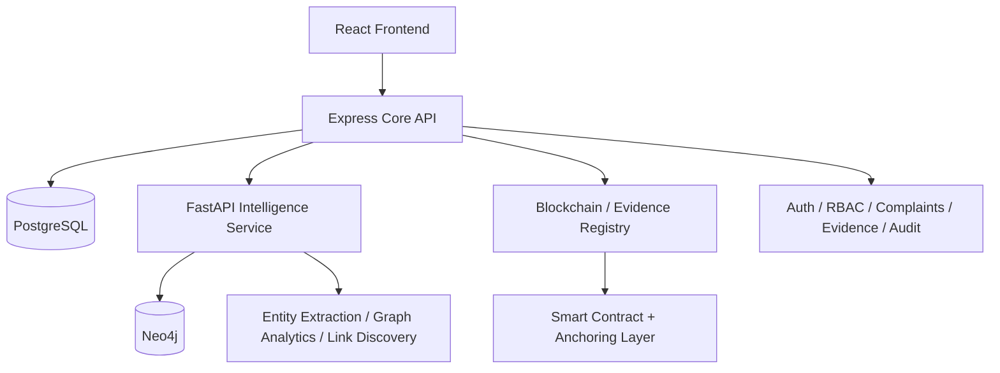

# ARGUS

<div align="center">

  
  
  
  

  <h3>AI-Powered Criminal Network Analysis System</h3>

  <p>
    ARGUS is a premium intelligence platform that transforms fragmented cybercrime complaints into a unified operational view, exposing criminal ecosystems, tracing suspicious financial trails, and preserving evidence credibility through blockchain-backed verification.
  </p>

</div>

---

## Executive Summary

ARGUS is a next-generation investigation platform built for one core challenge: cybercrime complaints are scattered, fragmented, and often appear unrelated until they are connected.

This platform ingests complaint intelligence, extracts entities from unstructured narratives, normalizes identifiers, links related complaints through shared infrastructure, detects criminal communities, ranks likely masterminds, and presents a visual map of the network behind the scam.

The result is a modern, intelligence-first response to cybercrime investigation—built for speed, clarity, and evidence trust.

---

## Why ARGUS Exists

The cybercrime reporting ecosystem generates massive volumes of disconnected data. A single complaint may include phone numbers, bank details, UPI IDs, wallet references, IPs, device fingerprints, email IDs, Telegram aliases, and geolocation metadata. When examined in isolation, these complaints appear small and unrelated.

But in reality, they often belong to larger criminal operations operating across states, communities, and financial flows.

ARGUS connects those fragments into a single investigation layer so investigators can identify patterns that humans would never detect manually at scale.

---

## Mission

ARGUS helps investigators, analysts, and cybercrime teams to:

- correlate complaint data across regions and scam patterns
- detect recurring infrastructure used by fraud networks
- identify high-risk entities and likely masterminds
- trace suspicious money movement and laundering flows
- validate evidence integrity and auditability
- investigate criminal ecosystems with operational confidence

---

## Problem Statement

The Indian cybercrime reporting pipeline receives complaints as isolated records, usually with free-text narratives and scattered metadata such as:

- phone numbers
- UPI IDs
- bank account numbers
- crypto wallets
- IP addresses
- device IDs
- email addresses
- Telegram handles
- locations
- screenshots and transaction IDs

The critical links between cases are frequently buried in the narrative itself. Without automated correlation, organized fraud rings appear to be scattered petty crime, central players stay hidden, and backlogs increase rapidly.

ARGUS addresses this by turning fragmented complaint data into a connected criminal intelligence graph.

---

## Product Vision

ARGUS is designed to move investigations from a complaint-centric model to a network-centric intelligence model.

It combines four critical layers:

1. AI-driven extraction from complaint narratives
2. Graph-based link analysis across shared entities and complaints
3. Investigative visualization for rapid analyst understanding
4. Blockchain-backed evidence integrity for trust and accountability

---

## Key Capabilities

### 1. Mission Control Dashboard

A real-time intelligence dashboard for cybercrime operations.

- national threat index and risk summaries
- active scam network counts
- high-risk wallet identification
- investigation workload overview
- India-wide cybercrime heatmap
- contextual threat feed and recent alerts
- complaint timeline and investigation activity

### 2. Criminal Network Explorer

The centerpiece of the platform: an interactive network graph that reveals how fraud operations are connected.

- force-directed graph visualization
- entity types such as phones, wallets, bank accounts, UPI IDs, IPs, devices, emails, locations, complaints, and persons
- cluster coloring and community detection
- influence scoring and mastermind highlighting
- expand-on-click investigation workflow
- entity filtering and detail analysis pane

### 3. Complaint Intelligence

Every complaint becomes a rich intelligence object.

- narrative parsing with extracted entities
- risk and confidence scoring
- shared-entity link discovery across complaints
- suspicious pattern highlighting in complaint text
- cluster and graph-based suspect correlation

### 4. Geo Intelligence

Regional patterns become visible in one operational view.

- state-wise hotspot analysis
- cross-state route visualization
- district and trend analysis
- investigative mapping overlays across regions

### 5. Money Flow Analysis

ARGUS visualizes suspicious movement of value across investigation paths.

- Sankey-based tracing of financial links
- victim to mule account to wallet progression
- intermediate routing and exchange visibility
- fraud value and financial path interpretation

### 6. Threat Feed & Alerting

The platform continuously produces actionable investigative signals.

- entity reuse detection
- circular flow analysis
- shared infrastructure detection
- severity-ranked alerts
- explainable rule-driven findings

### 7. Evidence Locker

Evidence is stored and tracked with operational trust.

- encrypted evidence storage
- SHA-256 hashing
- chain status verification
- evidence history and audit timeline
- blockchain-backed integrity proof

### 8. Admin & Governance

Operational oversight is built in.

- role-based access control
- user and unit management
- service health monitoring
- administrative workflows and intelligence governance

---

## Technology Stack

| Layer                | Technology                      |
| -------------------- | ------------------------------- |
| Frontend             | React, Vite, Tailwind CSS       |
| Visualization        | Cytoscape.js + fcose            |
| Data Visualization   | Recharts, d3-sankey, d3-geo     |
| Core API             | Node.js, Express                |
| Auth & Validation    | JWT, Zod, RBAC                  |
| Relational Database  | PostgreSQL 16                   |
| Intelligence Service | Python, FastAPI                 |
| NLP & Extraction     | spaCy + regex extraction        |
| Graph Analytics      | Neo4j + NetworkX                |
| Blockchain           | Solidity, Hardhat, OpenZeppelin |
| EVM Integration      | ethers v6                       |

---

## System Architecture

ARGUS follows a modular layered architecture designed for maintainability, resilience, and operational clarity.



### Design Principles

- PostgreSQL is the source of truth.
- Neo4j acts as a derived intelligence graph for investigative traversal.
- The frontend does not call the intelligence service directly.
- Evidence anchoring is asynchronous and non-blocking.
- The platform is designed to degrade gracefully when dependencies are unavailable.

---

## Repository Structure

```text
ARGUS/
├── backend/                 # Express API, auth, DB scripts, validation, verification tools
├── frontend/                # React dashboard and investigative interface
├── intel-service/           # FastAPI layer for extraction, analytics, and graph intelligence
├── blockchain/              # Solidity smart contracts and Hardhat setup
├── docs/                    # Project documentation and API contract
├── docker-compose.yml       # Local PostgreSQL and Neo4j services
├── package.json             # Root project metadata
├── README.md                # Product overview and onboarding
├── .gitignore
└── package-lock.json
```

---

## Getting Started

### Prerequisites

- Node.js 20+
- Python 3.10+
- Docker + Docker Compose
- Git

### 1) Start supporting services

```bash
docker compose up -d
```

This brings up:

- PostgreSQL on port 5432
- Neo4j on ports 7474 and 7687

### 2) Install backend dependencies

```bash
cd backend
npm install
```

### 3) Install frontend dependencies

```bash
cd frontend
npm install
```

### 4) Set up the intelligence service

```bash
cd intel-service
python -m venv .venv
source .venv/bin/activate
pip install -r requirements.txt
```

### 5) Run the backend

```bash
cd backend
npm run dev
```

Access:

- http://localhost:4000

### 6) Run the intelligence service

```bash
cd intel-service
source .venv/bin/activate
uvicorn app.main:app --host 0.0.0.0 --port 8000 --reload
```

### 7) Run the frontend

```bash
cd frontend
npm run dev
```

Access:

- http://localhost:5173

---

## Cold Start Workflow

A full system setup can be triggered with the backend scripts:

```bash
cd backend
cp .env.example .env
npm install
npm run setup
npm run dev
```

This performs the following:

- migrates the database schema
- seeds complaint and entity data
- loads NCRB reference data
- computes graph and risk scores
- generates threat alerts
- seeds evidence records
- projects intelligence into Neo4j

---

## Core Commands

### Backend

```bash
cd backend
npm run migrate
npm run seed
npm run load-reference
npm run generate-alerts
npm run verify-all
npm run test:unit
npm run smoke
npm run smoke-v2
npm run evidence-e2e
```

### Frontend

```bash
cd frontend
npm run dev
npm run build
npm run preview
npm run lint
```

### Intelligence Service

```bash
cd intel-service
source .venv/bin/activate
python tests/test_extract.py
uvicorn app.main:app --port 8000 --reload
```

---

## Security & Trust Model

ARGUS is built with safeguards suited for investigation-grade systems.

- JWT-based authentication
- role-based access control for investigators, analysts, supervisors, and admins
- encrypted evidence storage
- SHA-256 integrity validation
- blockchain-backed evidence anchoring
- structured API error handling with request IDs
- graceful degradation when services are partially unavailable

This ensures the platform remains operational even in degraded environments while preserving evidence and intelligence integrity.

---

## Verification & Demo Readiness

ARGUS includes a verification pipeline designed to validate more than uptime—it checks intelligence correctness.

- unit tests for normalization and graph logic
- determinism checks across seed runs
- planted-network validation to confirm ranking behavior
- smoke tests for API contract compliance
- end-to-end evidence validation against tampering scenarios

This makes the project credible for presentations and technically sound for further development.

---

## Intelligence Model

ARGUS brings together several information layers to reconstruct the real structure of a fraud operation.

- complaint narratives become linked entity graphs
- shared identifiers expose cross-case relationships
- communities reveal recurring criminal clusters
- centrality metrics identify high-impact actors
- financial flows show how illicit value moves through the system
- blockchain records preserve evidence integrity

This is what turns fragmented data into actionable intelligence.

---

## Impact

ARGUS is designed to help cyber investigation teams move from slow manual correlation to a smarter, network-first operational model.

By surfacing hidden relationships and proving evidence integrity, the system aims to:

- reduce investigative blind spots
- improve detection of organized scam operations
- expose coordinators and masterminds
- accelerate responses to cybercrime campaigns
- create more defensible digital evidence workflows

---

## Project Status

This project is a demo-focused implementation aligned with the Smart India Hackathon 2026 theme for AI-powered criminal network analysis and blockchain-backed evidence integrity.

It combines a production-style architecture, synthetic intelligence data, reference datasets, and investigation workflows suitable for demonstration, iteration, and real-world extension.

---

## Team Trust AEGiS

The project was developed by the following team members:

- [**Tanisha Soni**](https://www.linkedin.com/in/tanisha-soni-87aa74261/) - Team Lead & Cybersecurity
- [**Utkarsh .**](https://www.linkedin.com/in/utkarsh-void/) - Backend & AI/ML
- [**Nishant Nahar**](https://www.linkedin.com/in/nishantnahar2006/) - System Development & Graph Intelligence
- [**Venya Kejriwal**](https://www.linkedin.com/in/venya-kejriwal-5646a0333/) - Blockchain & Evidence Integrity
- [**Tiyas Chakrabarti**](https://www.linkedin.com/in/tiyas-chakrabarti-416a02268/) - Frontend & UI/UX
- [**Apurv Anand**](https://www.linkedin.com/in/apurv-anand-b08501320/) - Research & Documentation

---

## Contribution & Acknowledgements

ARGUS brings together expertise across several disciplines:

- investigation workflow design
- NLP-based entity extraction
- graph analytics and ranking
- financial intelligence visualization
- blockchain-backed trust and verification
- modern dashboard design for operational intelligence

---

## License

This project is intended for educational, demonstrative, and collaborative research use within the context of the Smart India Hackathon and related innovation efforts.

---

## Final Note

ARGUS represents a strong fusion of AI, graph intelligence, cybersecurity, and blockchain trust. It is built not only to visualize data, but to uncover hidden networks, accelerate investigation decisions, and strengthen the integrity of evidence in modern cybercrime workflows.
